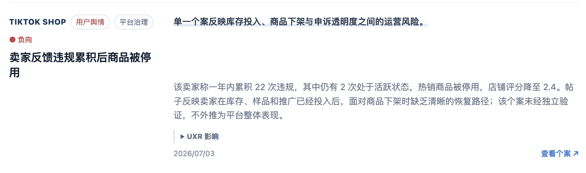

# E-commerce Sentiment Weekly Reporter

[简体中文](README.md) | [English](README.en.md)

A Codex Skill for e-commerce, user research (UXR), and competitive-intelligence teams. It monitors public information for selected markets and reporting weeks, then turns news, regulatory notices, seller policies, consumer complaints, and industry data into concise weekly reports designed for fast team-chat scanning.

> Skill: `ecom-sentiment-weekly-reporter`  
> Author: cty

## What it does

- Monitors e-commerce developments by market. The default setup supports the US and UK and can be extended.
- Covers Amazon, Temu, SHEIN, TikTok Shop, eBay, Walmart, Meta / Instagram, Google, and other configured platforms.
- Clearly labels items as **News**, **Policy Signal**, or **User Sentiment**.
- Tracks regulation and compliance, seller governance, fulfillment, returns and refunds, pricing and promotions, content commerce, advertising and recommendations, payment safety, product authenticity, and customer service.
- Adds sentiment, key facts, relevant UXR metrics, publication dates, and original sources to every item.
- Produces Markdown reports or compact HTML briefs optimized for group sharing.
- Can send reports to a user-configured Feishu group and archive them to a Feishu document. Local report generation remains available when Feishu integrations are unavailable.

## Report layout

The compact HTML format combines multiple markets in one file—for example, the US first and the UK second—and uses a full-width, single-column layout:

1. Up to three cross-market takeaways;
2. Information grouped by market and platform;
3. Each item includes type, sentiment, headline, a bold key fact, a 2–4 sentence summary, UXR implications, date, and source;
4. Images are disabled by default to reduce decoration and unused space;
5. The layout remains single-column on mobile for easy reading and sharing.

### Example output

The image below is a real excerpt from a compact HTML report generated by the Skill. Platform, content type, sentiment, headline, key fact, summary, UXR implications, date, and original source stay within one continuous reading flow.



> The screenshot demonstrates the report layout only. News, platform coverage, and conclusions change with the selected markets, dates, and sources.

## Installation

### Install with Codex

Send this instruction to Codex:

```text
Install the Skill from https://github.com/caitianyuaan/ecom-sentiment-weekly-reporter
```

After installation, open a new task or ask Codex to use `$ecom-sentiment-weekly-reporter`.

### Manual installation

Clone the repository into your personal Codex Skills directory:

```bash
mkdir -p ~/.codex/skills
git clone https://github.com/caitianyuaan/ecom-sentiment-weekly-reporter.git \
  ~/.codex/skills/ecom-sentiment-weekly-reporter
```

If it is already installed, run `git pull` in that directory to update it.

## Quick start

Describe the markets, reporting period, scope, and output format directly:

```text
Use $ecom-sentiment-weekly-reporter to create a US and UK e-commerce sentiment report for the first week of July.
Put the US first and the UK second. Aim for 8–12 items per market and cover news, regulatory notices, platform seller policies, consumer complaints, and industry data.
Clearly label each item as News, Policy Signal, or User Sentiment. Produce one compact English HTML file without images and sign it as cty.
```

You can also run a saved personal configuration with a short instruction:

```text
Use $ecom-sentiment-weekly-reporter to generate this week's report with my saved configuration.
```

## First-time configuration

The Skill resolves configuration in this order:

1. Requirements explicitly stated in the current instruction;
2. Personal settings in `~/.ecom-sentiment-weekly-reporter/config.json`;
3. Guided onboarding when required settings are missing.

First run does not stop at a “config not found” error. It offers two paths:

- **Use the recommended setup and generate now:** US + UK, major platforms, all observation groups, balanced sources, compact Chinese HTML, and local-only delivery.
- **Customize:** choose markets and platforms, news topics and observation metrics, source strategy, then file formats and delivery channels.

File format and delivery are configured separately. Files can be HTML, Markdown, or both; delivery can be local-only, Feishu group, Feishu document, or both Feishu destinations. Feishu IDs and attribution are requested only after a Feishu channel is selected.

Create a personal config from the template:

```bash
cd ~/.codex/skills/ecom-sentiment-weekly-reporter
python3 scripts/init_user_config.py \
  --mode follow_creator_settings \
  --from-template
```

Validate the configuration:

```bash
python3 scripts/init_user_config.py --validate
```

After upgrading from an older release, migrate the saved configuration once:

```bash
python3 scripts/init_user_config.py --migrate
```

Migration creates a `.v1.bak` backup, preserves the existing scope and Feishu destinations, upgrades the config to version 2, and changes the legacy template's disabled HTML setting to the new enabled default.

Main configuration fields:

| Field | Purpose |
| --- | --- |
| `markets` | Markets to monitor, such as `US` and `UK` |
| `platforms` | Priority platforms |
| `topics` | Priority monitoring topics |
| `observation_metrics` | Observation groups such as product, discovery, fulfillment, trust, and business growth |
| `source_profile` | Source strategy, such as `default` or `official_first` |
| `sources.include/exclude` | Sources to include or exclude |
| `items_per_platform` | Target number of items per platform |
| `report_language` | Report locale, such as `zh-CN` or `en` |
| `output.html` | HTML toggle, layout, combined-market setting, and image setting; enabled by default |
| `feishu_group_id` | Feishu group ID; unused during local-only runs |
| `feishu_doc_url` | Feishu archive document; unused during local-only runs |
| `sender_name` | Report attribution |

See [`references/sample-config.template.json`](references/sample-config.template.json) for an example.

## Common prompts

### Generate the current weekly report

```text
Use $ecom-sentiment-weekly-reporter with my saved configuration. Generate the current weekly report locally only.
```

### Specify an exact date range

```text
Generate a US and UK e-commerce sentiment report for 2026-07-01 through 2026-07-07 as one English HTML file.
```

### Limit platforms or topics

```text
Monitor Amazon, TikTok Shop, and Temu in the UK. Focus only on seller policy, returns and refunds, and consumer complaints.
```

### Increase information density

```text
Use the consulting_compact layout without images. Keep the key fact and a 2–4 sentence summary for every item, bold the most important points, and reduce card whitespace.
```

### Send and archive with Feishu

```text
Generate this week's report with my saved configuration, send it to my configured Feishu group, and archive it to my configured Feishu document.
```

## Date and volume safeguards

The reporting window is a hard constraint; item volume is a target:

- Include only information published within the requested period or directly and verifiably tied to it.
- Do not use older background reports, stale research, or post-period follow-ups to fill a quota.
- Do not relabel an old publication with an in-window date simply because the topic remains relevant.
- If the verified sample is smaller than requested, retain the valid sample and disclose the shortfall.
- When multiple outlets cover the same event, keep the strongest source and use other coverage only for corroboration.
- If the source URL contains an explicit publication date, it must not conflict with the date shown in the report. A mismatch requires re-verification and blocks delivery.

Therefore, “8–12 items per market” describes the desired coverage, not permission to compromise recency or accuracy.

## Sources and quality controls

The Skill prioritizes official notices, regulators, platform newsrooms, company blogs, reputable media, and clearly attributable industry analysis. During execution, it:

- searches by market, platform, topic, and date;
- records executed queries and inspected candidates;
- scores candidates for relevance, UXR value, market specificity, and source quality;
- merges duplicate URLs and repeated coverage of the same event;
- produces internal coverage QA to identify missing searches, absent candidates, rejected candidates, and excessive source concentration.

**User Sentiment** normally represents verified qualitative samples from consumers or sellers. A single post should not be generalized into a platform-wide conclusion.

## Outputs

- **Markdown:** the canonical editable report suitable for documents and further editing.
- **HTML:** a browser-ready consulting brief suitable for screenshots and group sharing.
- **Feishu delivery and archive:** performed when valid destinations are configured and the runtime provides the required integration.

When HTML output is enabled, Feishu delivery prefers an interactive card or HTMLBox so the compact report layout is preserved. It falls back to a Markdown-derived `post` message only when the available Feishu integration does not support cards or HTMLBox, and the run result must disclose that fallback.

See [`references/report-format-html.md`](references/report-format-html.md) for the HTML presentation contract.

## FAQ

### Why are there fewer than eight items for a market?

If the requested period does not contain enough high-quality, verifiable information, the Skill reports fewer items and explains the gap instead of filling it with old news.

### Why are images disabled by default?

The default report is optimized for fast reading in team chats. Removing images improves information density and prevents loosely related illustrations from appearing beside an event. To use images, set `output.html.include_images` to `true` and require images to belong to the exact event.

### Can it generate local files only?

Yes. State: “Generate locally only; do not send to Feishu or archive the report.”

### Can it monitor other markets or platforms?

Yes. Add markets, platforms, topics, and preferred sources in the prompt or personal configuration.

### Can it run automatically every week?

Yes. Create a recurring Codex task using this short prompt:

```text
Run ecom-sentiment-weekly-reporter with my saved configuration.
```

Run it manually once before scheduling to verify the date convention, output directory, source scope, and delivery destinations.

## Repository structure

```text
ecom-sentiment-weekly-reporter/
├── SKILL.md              # Core workflow and rules
├── agents/openai.yaml    # Codex UI metadata
├── references/           # Source strategy, configuration, and report formats
├── scripts/              # Configuration, date, preflight, state, and validation tools
└── tests/                # Stability and formatting tests
```

## Limitations

- Reports are based on public sources and are not legal, compliance, investment, or financial advice.
- News and policy can continue to evolve; review original sources before making important decisions.
- Consumer complaints and community discussions are qualitative signals. Do not treat them as incidence rates or population-level statistics without reliable quantitative evidence.
